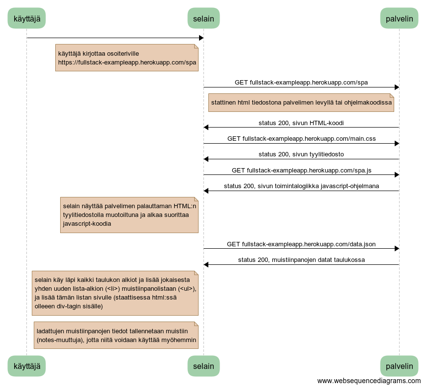

## 0.3 Navigointi muistiinpanojen sivulle

Kun navigoidaan sivulle https://fullstack-exampleapp.herokuapp.com/notes


```
käyttäjä->selain:
note left of selain
käyttäjä kirjottaa osoiteriville
https://fullstack-exampleapp.herokuapp.com/notes
end note
selain->palvelin: GET fullstack-exampleapp.herokuapp.com/notes
note left of palvelin
  stattinen html tiedostona palvelimen levyllä tai ohjelmakoodissa
end note
palvelin->selain: status 200, sivun HTML-koodi

selain->palvelin: GET fullstack-exampleapp.herokuapp.com/main.css
palvelin->selain: status 200, sivun tyylitiedosto

selain->palvelin: GET fullstack-exampleapp.herokuapp.com/main.js
palvelin->selain: status 200, sivun toimintalogiikka javascript-ohjelmana

note left of selain
 selain näyttää palvelimen palauttaman HTML:n 
 tyylitiedostolla muotoiltuna ja alkaa suorittaa
 javascript-koodia
end note

selain->palvelin: GET fullstack-exampleapp.herokuapp.com/data.json
palvelin->selain: status 200, muistiinpanojen datat taulukossa

note left of selain
 selain käy läpi kaikki taulukon alkiot ja lisää jokaisesta
 yhden uuden lista-alkion (<li>) muistiinpanolistaan (<ul>), 
 ja lisää tämän listan sivulle (staattisessa html:ssä 
 olleeen div-tagin sisälle)
end note
```

## 0.4 Uusi muistiinpano

Kun tehdään uusi muistiinpano sivulla https://fullstack-exampleapp.herokuapp.com/notes


```
käyttäjä->selain:
note left of selain
käyttäjä kirjottaa uuden muistiinpanon ja painaa 
tallenna-nappia
end note
selain->palvelin: POST fullstack-exampleapp.herokuapp.com/new_note
note left of palvelin
  palvelin lukee uuden muistiinpanon tiedot POST-kutsusta 
  ja tallentaa muistiinpanon tietokantaansa
end note
palvelin->selain: status 302, location: /notes

note left of selain
selain siirtyy uudelle sivulle palvelimen antaman 
tiedon perusteella
end note

note left of selain
lataa siis sivun fullstack-exampleapp.herokuapp.com/notes
eli suoritus jatkuu täsmälleen vastaavasti kuin kaaviossa 0.3
end note
```

## 0.5 Single page app

Kun navigoidaan sivulle https://fullstack-exampleapp.herokuapp.com/spa

Melkein vastaava kuin kaavio 0.3, mutta oleellisena erona se, että muistiinpanojen tiedot laitetaan talteen muistiin (notes-muuttujaan)



```
käyttäjä->selain:
note left of selain
käyttäjä kirjottaa osoiteriville
https://fullstack-exampleapp.herokuapp.com/spa
end note
selain->palvelin: GET fullstack-exampleapp.herokuapp.com/spa
note left of palvelin
  stattinen html tiedostona palvelimen levyllä tai ohjelmakoodissa
end note
palvelin->selain: status 200, sivun HTML-koodi

selain->palvelin: GET fullstack-exampleapp.herokuapp.com/main.css
palvelin->selain: status 200, sivun tyylitiedosto

selain->palvelin: GET fullstack-exampleapp.herokuapp.com/spa.js
palvelin->selain: status 200, sivun toimintalogiikka javascript-ohjelmana

note left of selain
 selain näyttää palvelimen palauttaman HTML:n 
 tyylitiedostolla muotoiltuna ja alkaa suorittaa
 javascript-koodia
end note

selain->palvelin: GET fullstack-exampleapp.herokuapp.com/data.json
palvelin->selain: status 200, muistiinpanojen datat taulukossa

note left of selain
 selain käy läpi kaikki taulukon alkiot ja lisää jokaisesta
 yhden uuden lista-alkion (<li>) muistiinpanolistaan (<ul>), 
 ja lisää tämän listan sivulle (staattisessa html:ssä 
 olleeen div-tagin sisälle)
end note

note left of selain
 ladattujen muistiinpanojen tiedot tallennetaan muistiin 
 (notes-muuttuja), jotta niitä voidaan käyttää myöhemmin
end note
```

## 0.6 Uusi muistiinpano SPA:ssa

Kun tehdään uusi muistiinpano sivulla https://fullstack-exampleapp.herokuapp.com/spa


```
käyttäjä->selain:
note left of selain
käyttäjä kirjottaa uuden muistiinpanon ja painaa 
tallenna-nappia
end note
selain->palvelin: POST fullstack-exampleapp.herokuapp.com/new_note_spa
note left of palvelin
  palvelin lukee uuden muistiinpanon tiedot POST-kutsusta 
  ja tallentaa muistiinpanon tietokantaansa
end note
palvelin->selain: status 201 eli luonti onnistui

note left of selain
lisätään uusi muistiinpano sivun latauksen yhteydessä 
alustettuun notes-taulukkoon ja päivitetään sivun html 
notes-taulukon mukaiseksi (tehdään kokonaan uusi ul-lista 
ja korvataan aiempi sivulla ollut lista sillä)
end note
```


